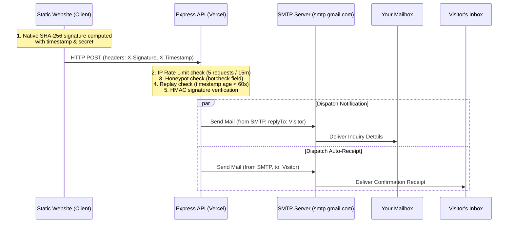

# Universal Contact Form Backend (Node.js + SMTP)


A lightweight, 100% free, self-hosted contact form API server built with **Node.js, Express, and Nodemailer**. This serves as a secure, private alternative to paid form forwarding services like FormSubmit, Web3Forms, or Formspree.

This backend handles incoming submissions for any type of site (blogs, e-commerce storefronts, business landing pages, portfolios), protects your forms from automated robots using a hidden spam honeypot, blocks DDoS floods with IP rate limiting, verifies incoming payloads cryptographically to prevent tampering, sends a beautifully styled notification to you, and automatically delivers a confirmation receipt to your visitors.

---

## 🗺️ How it Works under the Hood



---

## 🔒 Advanced Security Features

* **HTTPS (SSL/AES-256 in Transit)**: By deploying on Vercel, all incoming data is encrypted in transit using industry-standard TLS (AES-256).
* **HMAC Request Signature (SHA-256)**: The client signs the form inputs + a timestamp using a shared secret key. The server recalculates this signature. If the request was tampered with, the signature will mismatch, and the request is immediately dropped (`403 Forbidden`).
* **Replay Attack Protection**: The signature is only valid for **60 seconds**. If a malicious actor intercepts the network request and attempts to resubmit it later, the server will block it due to timestamp expiry (`401 Unauthorized`).
* **IP-based Rate Limiting**: The server tracks requests by IP address. If an IP sends more than **5 submissions in a 15-minute window**, the server rejects further attempts with an HTTP `429 Too Many Requests` status, protecting your SMTP daily quota.
* **Anti-Spam Honeypot**: The hidden `botcheck` input field is invisible to humans. Spam bots scan and fill out all inputs. If the field is filled, the server drops the request silently but returns a mock success status to trick the bot.

---

## 🛠️ Step 1: Getting Your Google App Password (Free SMTP)

To send emails through your Gmail account securely, you cannot use your regular Gmail password due to security blocks. Follow these steps to generate a Google-approved App Password:

1. Visit your **Google Account settings** at [myaccount.google.com](https://myaccount.google.com/).
2. On the left sidebar, click **Security**.
3. Under the *How you sign in to Google* section, ensure **2-Step Verification** is turned **ON**.
4. Click on **2-Step Verification**, scroll to the bottom of the page, and click **App Passwords**.
5. Give the app a name (e.g. `Website Contact Backend`) and click **Create**.
6. Google will display a **16-character code** (e.g. `abcd efgh ijkl mnop`).
7. **Copy this code!** You will paste this into your environment variables.

---

## 💻 Step 2: Running Locally

### 1. Install Dependencies
Open your terminal in this project directory and run:
```bash
npm install
```

### 2. Configure Environment Variables (`.env`)
Create a file named `.env` in the root folder (a template is available in `.env.example`):
```env
PORT=5000

# SMTP Configurations for Gmail
SMTP_HOST=smtp.gmail.com
SMTP_PORT=587
SMTP_USER=your_gmail_address@gmail.com
SMTP_PASS=paste_your_16_character_app_password_here

# The email address where you want to receive contact inquiries
RECEIVER_EMAIL=your_gmail_address@gmail.com

# Website Owner / Brand Name (used for Auto-Responder email signatures)
SENDER_NAME="Your Brand Name"

# Cryptographic signature secret key (Choose a random string, e.g. PasanSecureKey123)
# Leave blank to temporarily disable signature verification for local testing
API_SIGNATURE_SECRET="your_shared_signature_secret_here"
```

### 3. Launch Development Server
Start the backend locally with nodemon for automatic hot-reloads:
```bash
npm run dev
```
Confirm you see:
`✓ SMTP Mail Server connection successfully verified. Ready to deliver emails!`

---

## 🌐 Step 3: Deploying to Vercel for Free (100% Free & No Card)

To keep your form API working 24/7 without keeping your computer on, you can deploy it to **Vercel** for free:

1. Initialize a Git repository in this folder, commit your files (note: the `.gitignore` will automatically prevent `.env` and `node_modules` from uploading), and push it to a **GitHub repository**.
2. Visit [Vercel.com](https://vercel.com) and click **Sign Up**. Choose **Continue with GitHub** (this verifies your identity so you do not need to add any card details).
3. Once logged in, click **Add New** -> **Project**.
4. Import the repository you just pushed.
5. In the configurations, expand the **Environment Variables** section. Add all the key-value pairs from your `.env` file:
   * `SMTP_HOST`: `smtp.gmail.com`
   * `SMTP_PORT`: `587`
   * `SMTP_USER`: `your_gmail_address@gmail.com`
   * `SMTP_PASS`: `your_16_character_app_password`
   * `RECEIVER_EMAIL`: `your_gmail_address@gmail.com`
   * `SENDER_NAME`: `Your Name / Brand`
   * `API_SIGNATURE_SECRET`: `your_shared_signature_secret_here`
   *(Vercel handles ports automatically, so you don't need to specify `PORT`)*
6. Click **Deploy**.
7. Once deployment finishes, Vercel will generate a live API URL (e.g. `https://website-contact-api.vercel.app`).
8. Copy this URL! Update the `API_URL` variable in your frontend website's JavaScript file (`app.js`) to:
   ```javascript
   const API_ENDPOINT = 'https://website-contact-api.vercel.app/api/contact';
   ```

---

## 📝 Step 4: Integrating with Your Frontend Site

### Method A: Sleek AJAX/Fetch Submission with HMAC Signature (Recommended)
This method intercepts form submissions, runs validation, computes a SHA-256 HMAC signature natively in the browser, sends it using custom headers, and handles the loading state.

#### 1. HTML Structure
```html
<form id="contact-form" novalidate>
    <!-- Spam Honeypot: Invisible to human users but catches bots -->
    <input type="text" name="botcheck" style="display: none;" tabindex="-1" autocomplete="off">

    <div class="input-group">
        <input type="text" id="name" name="name" required placeholder="Full Name">
    </div>
    <div class="input-group">
        <input type="email" id="email" name="email" required placeholder="Email Address">
    </div>
    <div class="input-group">
        <textarea id="message" name="message" required placeholder="Your Message" rows="5"></textarea>
    </div>

    <button type="submit" id="submit-btn">Send Message</button>
</form>
```

#### 2. JavaScript Controller (with Cryptographic Hashing)
```javascript
const form = document.getElementById('contact-form');
const submitBtn = document.getElementById('submit-btn');

// Replace with your local host 'http://localhost:5000/api/contact' for testing
// or your live Vercel URL in production
const API_ENDPOINT = 'https://website-contact-api.vercel.app/api/contact';

// Shared secret key (MUST match the API_SIGNATURE_SECRET in your Vercel configurations)
const SIGNATURE_SECRET = "your_shared_signature_secret_here";

// Native browser function to generate SHA-256 hash using Web Crypto API
async function generateSignature(name, email, message, timestamp, secret) {
    const rawData = name.trim() + email.trim() + message.trim() + timestamp + secret;
    const encoder = new TextEncoder();
    const data = encoder.encode(rawData);

    // Hash the data using native SubtleCrypto API
    const hashBuffer = await window.crypto.subtle.digest('SHA-256', data);

    // Convert buffer to hex string
    const hashArray = Array.from(new Uint8Array(hashBuffer));
    const hashHex = hashArray.map(b => b.toString(16).padStart(2, '0')).join('');
    return hashHex;
}

form.addEventListener('submit', async (e) => {
    e.preventDefault();

    // Gather inputs
    const name = document.getElementById('name').value.trim();
    const email = document.getElementById('email').value.trim();
    const message = document.getElementById('message').value.trim();
    const botcheck = form.querySelector('input[name="botcheck"]').value;

    if (!name || !email || !message) {
        alert("Please fill out all required fields.");
        return;
    }

    // Update button loading state
    submitBtn.innerText = "Sending...";
    submitBtn.disabled = true;

    // Generate dynamic timestamp & secure signature
    const timestamp = Date.now().toString();
    const signature = await generateSignature(name, email, message, timestamp, SIGNATURE_SECRET);

    const payload = { name, email, message, botcheck };

    try {
        const response = await fetch(API_ENDPOINT, {
            method: 'POST',
            headers: {
                'Content-Type': 'application/json',
                'Accept': 'application/json',
                'X-Signature': signature,
                'X-Timestamp': timestamp
            },
            body: JSON.stringify(payload)
        });

        const result = await response.json();

        if (response.ok && result.success) {
            alert("Thank you! Your message was delivered successfully.");
            form.reset();
        } else {
            alert(result.message || "Failed to send message.");
        }
    } catch (error) {
        alert("A connection error occurred. Make sure your server is running.");
    } finally {
        submitBtn.innerText = "Send Message";
        submitBtn.disabled = false;
    }
});
```

---

### Method B: Standard HTML Action Redirect (Zero-JS)
*Note: Since HTML form redirects cannot compute cryptographic headers natively on submit, you must **remove/leave empty** the `API_SIGNATURE_SECRET` variable in Vercel to allow bypass authentication for this method.*

```html
<!-- Set action to your Vercel server API endpoint -->
<form action="https://website-contact-api.vercel.app/api/contact" method="POST">
    <!-- Spam Honeypot -->
    <input type="text" name="botcheck" style="display: none;" tabindex="-1" autocomplete="off">

    <!-- Redirect URL: Where to forward the user upon successful submission -->
    <input type="hidden" name="_next" value="https://yourwebsite.com/thank-you.html">

    <input type="text" name="name" required placeholder="Full Name">
    <input type="email" name="email" required placeholder="Email Address">
    <textarea name="message" required placeholder="Your Message" rows="5"></textarea>

    <button type="submit">Submit Message</button>
</form>
```
